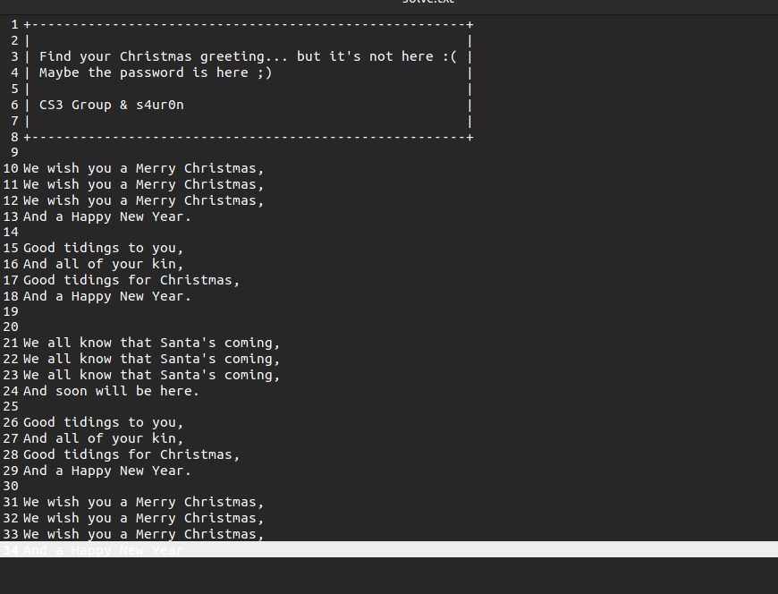

<h1>INICIO DEL RETO</h1> 

Empezamos con un .pcap en el cual se encuentra la traza de un actor malicioso que exfiltró un fichero de un servidor.

Abrimos el .pcap con el WireShark y nos encontramos lo siguiente:

A continuación vemos que el fichero se ha enviado usando <a href="http://www.columbia.edu/kermit/ck90.html">Kermit</a> el cual es un software de comunicación de los 80 que permite transferir archivos entre terminales.

Por lo tanto tendremos que "deshacer" lo que el protocolo del Kermit haga a la hora de enviar los paquetes y poder extraer el archivo.

Además, si nos fijamos, el archivo está codeado en base64, lo que nos será de utilidad más adelante:

<

<h2>Hora de leer la documentación</h2>

Lo primero es entender cómo funciona el protocolo antes de darse cabezazos contra la pared (no sigáis mis pasos...), por lo que acudimos a <a href="https://www.kermitproject.org/kproto.pdf">Kermit Protocol Manual</a> en el que se nos explica con todo tipo de detalles su funcionamiento.

Resumiendo un poco, lo que hace el Kermit es pasar a ASCII-friendly todos los bytes que se van a enviar por la línea, de manera que sea "universal" y no haya confusiones a la hora de interpretar paquetes.

Las 3 claves que nos conciernene a la hora de deconstruir nuestro archivo son:

<ul>
<li>Negociación previa al envio de datos</li>

<li>Qué estructura tendrá cada paquete?</li>

<li>Repeat Count Prefixing</li>

<li> Window size </li>
</ul>

<h2>Analizando la negociación</h2>

Todos los paquetes de Kermit se componen de lo siguiente: 

<ul>
<li> Mark especifica el principio del paquete (generalmente, SOH 0x01)</li>
<li> LEN la longitud del paquete (este parámetro es uncontrollified, es decir, tenemos que restarle 32, ya que es lo que lo convierte en ASCII friendly.</li>
<li> SEQ es para el ACK, también es uncontrollified, por lo que tenemos que restarle 32.</li>
<li> TYPE nos indicará qué tipo de paquete es, data, ack, nack, init, end of file....</li>
<li> DATA lo que nos interesa</li>
<li> CHECK para comprobación de errores</li>

</ul>

Visto esto, sabemos que tenemos que encontrar un paquete en el cual tenga en su campo TYPE, el valor S ( de Send initiate): 

Si nos vamos al WireShark, conociendo ahora cómo se componen los paquetes de Kermit, encontramos el send initiation: 

Por lo tanto tenemos, el inicio del paquete en rojo, en amarillo el LEN, en azul la SEQ, en verde el TYPE, que como podemos ver, tiene el valor 0x53, que en ASCII es una "S" (lo podemos ver en la representación de la derecha), en morado la negociación y 0d 00 en marrón, el final del paquete.

De la negociación, los paquetes que nos interesan son:
<ul>
<li> CHKT</li>
<li> REPT</li>
<li> QCTL</li>
<li> CAPAS </li>
</ul>

En la documentación está bien detallado, pero para hacer un breve resumen:

<h3> CHKT </h3>

El type de check que se va a realizar, en nuestra negotiation tenemos el valor 3, lo que hace un CRC-CCIIT (3 bytes) esto es importante a la hora de extraer el fichero.

<h3> REPT </h3>

 Cuando un carácter se repite, Kermit no printa "AAAA" por ejemplo, usa la siguiente notación ~$A , ~(tilde) indica que el siguiente valor va a ser el cuantificador del número de repeticiones (este carácter es ascii-friendly, por lo que en realidad tenemos que restarle -32 para saber el valor numérico real, es decir $ tiene el valor 36 en ascii, le quitamos 32, 36-32 = 4  repeticiones) y el siguiente valor, la A, se repetirá 4 veces.

<h3> QCTL </h3> 

 Nos indica el carácter que va a preceder los escapes de CTRL, por ejemplo si Kermite envía un CTRL+J, simplemente enviará #J.

<h3> CAPAS </h3> 

 Aquí podemos ver que el bitmask de "Extended packet" está marcado, lo que le permite a Kermit enviar varios paquetes sin esperar los ACKS, además de esto se incrementa el header el paquete, por lo que tenemos que tenerlo en cuenta. 

Bien, ya hemos avanzado un poco más.

 Estos flags y configuraciones que hemos visto en la negociación del Kermit, nos van a cambiar un poco la estructura de cómo van a ser los paquetes, veamos como quedarían: 

 

 Solo nos interesan los paquetes de data, tendremos que borrar los 3 primeros bytes antes de cada "0x0d 0x00" y los 7 bytes siguientes, 3+2+7 = 12 bytes. 

A continuación buscamos el/los paquetes que haya envíado Kermit con el TYPE D de data, para trabajar más cómodamente nos lo llevamos a la terminal, la parte amarilla es de kermit (MARK, LEN, SEQ, TYPE, LENX1, LENX2, HCHECK) y la verde es nuestra data, he marcado a modo de ejemplo un par de count repeaters (en azul) y un par de escaped CTRL, en rojo, que indicarían LINE FEED un salto de página: 

Una vez en el terminal extraemos solo la parte hexadecimal que será con la que trabajemos, y escribí un pequeño programa para realizar la limpieza de forma automática, el programa se encarga de: 
<ol>
<li> Quita todos los bytes que inician el paquete, teniendo en cuanta que lleva headers extendidos, su checksum y el final, lo que se traduciría en un simple regex de (0xXX 0xXX 0xXX 0d 00 01 0xXX 0xXX 0xXX 0xXX 0xXX 0xXX)</li>
<li> Para los hex a su representación en ASCII</li>
<li> para #J, sustituye por \n y para las repeticiones, haz la lógica pertinente</li>
</ol>

Y con esto ya tendríamos nuestra imagen en b64, con uudecode extraemos la imagen: 

Con binwalk extraemos de la imagen un .ogg, el cual si abrimos se rie de nosotros.

Después de mirar el espectograma del archivo, los LSB, vemos que si pasamos le binwalk (fail), nos muestra que detecta un 7z (pero no es un 7z, o sí?): 

Tras leer bastante, vemos que es un binary polyglot (archivos que son válidos para varios formatos), por lo que simplemente extraemos como si fuera un 7z.

Lo cual abrimos el .cpio y encontramos 2 archivos, un txt y un html cifrado: 

 

Abrimos el .txt y encontramos un villancico donde nos dice que puede que la contraseña esté ahí: 

A continuación hacemos bruteforce con las keywords del txt, hasta que damos con la buena, que es Christmas: 

Abrimos el html y...

Felices fiestas a todos! Y muchas gracias <a href="https://twitter.com/NN2ed_s4ur0n/">@s4ur0n</a> por el reto!

</body>
</html>

